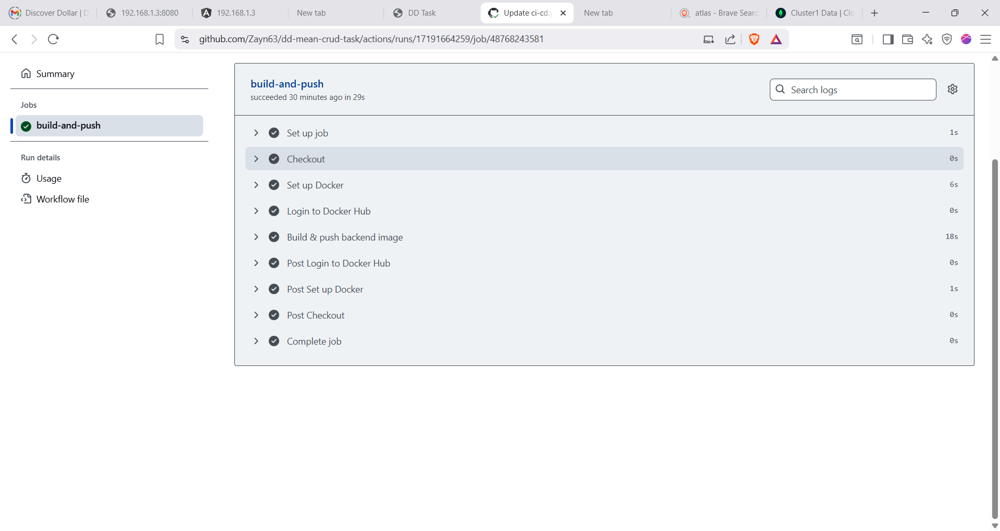

# MEAN CRUD Application – Full Deployment

## Overview

This repository contains a **full-stack MEAN (MongoDB, Express, Angular, Node.js) CRUD application**. The application has been **fully containerized using Docker** and deployed on a remote **Ubuntu VM** using **Docker Compose**. The CI/CD pipeline is implemented via **GitHub Actions**, which automatically builds and pushes Docker images for both frontend and backend whenever code changes are pushed to the `main` branch.  

**Key Highlights:**

- Backend: Node.js + Express connected to **MongoDB Atlas**.  
- Frontend: Angular 15 application served via Docker container.  
- CI/CD: Fully functional GitHub Actions workflow.  
- Deployment: Backend and frontend running on VM via Docker Compose.  
- Task Completion: All assignment requirements are fulfilled.

---

## Repository Structure

├── backend/ # Node.js + Express backend code
├── frontend/ # Angular frontend code
├── .github/
│ └── workflows/
│ └── ci-cd.yml # GitHub Actions workflow
├── docker-compose.yml # Docker Compose for VM deployment
└── README.md


---

## Prerequisites

- Ubuntu VM with **Docker** and **Docker Compose** installed.  
- MongoDB Atlas cluster for the database.  
- GitHub repository secrets configured for Docker Hub access:  
  - `DOCKER_USERNAME`  
  - `DOCKER_PASSWORD` (or personal access token with push permissions)  

---

## Setup & Deployment Instructions

### 1. Clone the Repository on VM
```bash git clone https://github.com/Zayn63/dd-mean-crud-task.git cd dd-mean-crud-task

### 2 Configure Backend Environment
   backend:
  image: zayn63/crud-backend:latest
  container_name: crud-backend
  environment:
    - MONGO_URI=mongodb+srv://<username>:<password>@cluster0.mongodb.net/mydb?retryWrites=true&w=majority
    - NODE_ENV=production

### 3. Deploy the Application
     docker-compose down
     docker-compose up -d
    Backend accessible at: http://192.168.1.3:3000
    Frontend accessible at: http://192.168.1.3:4200

CI/CD Workflow

The CI/CD pipeline is implemented via GitHub Actions:

Triggered on push to main branch.

Builds Docker images for frontend and backend.

Pushes images to Docker Hub automatically.

Workflow file: .github/workflows/ci-cd.yml


Final:

Task Completion Status

All assignment requirements have been fully completed:

Repository setup ✔️

Dockerfiles for backend & frontend ✔️

CI/CD workflow via GitHub Actions ✔️

Docker images pushed to Docker Hub ✔️

VM deployment using Docker Compose ✔️

Backend connected to MongoDB Atlas ✔️

Frontend & backend running successfully ✔️

Documentation included


## Frontend Screenshots

These screenshots show the frontend Angular application running in the browser:


## CI/CD Workflow Screenshot

This screenshot shows the GitHub Actions CI/CD workflow building and pushing Docker images:




## Frontend Screenshots

These screenshots show the frontend Angular application running in the browser:


## CI/CD Workflow Screenshot

This screenshot shows the GitHub Actions CI/CD workflow building and pushing Docker images:


Author

Junaid Mansuri
GitHub: https://github.com/Zayn63

Email: [junaidmansuri7863@gmail.com]
